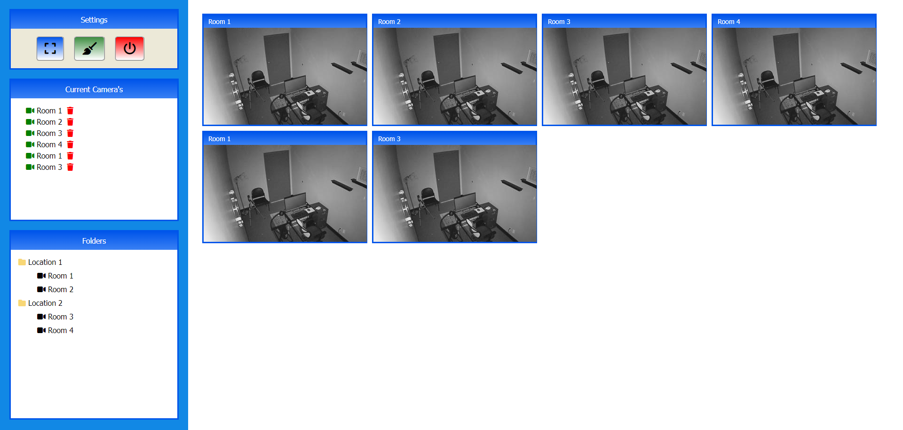

# Security Camera's Monitoring

## Introduction
The SCM App is a simple web application that allows users to drag and drop camera elements to create a list of their favorite cameras. Users can add cameras to the list by dragging them from a selection of available cameras onto the drop area. 
Each dropped camera is represented by a draggable element with a corresponding icon and a delete button for easy removal.

## Features
+ Drag and drop functionality for adding cameras to the list.
+ Display of camera icons to visually represent each dropped camera.
+ Delete button for removing cameras from the list.
+ Local storage integration for saving and restoring the list of dropped cameras.

## Usage
+ Drag a camera from the available cameras section.
+ Drop the camera onto the drop area to add it to the list.
+ To remove a camera, click the delete button next to the camera.

## Technologies Used
+ HTML5
+ CSS3
+ JavaScript
